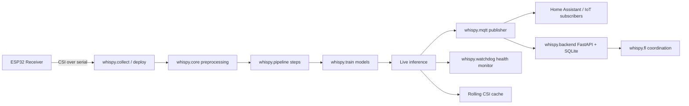
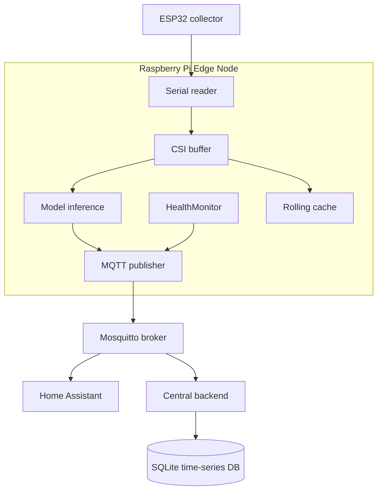
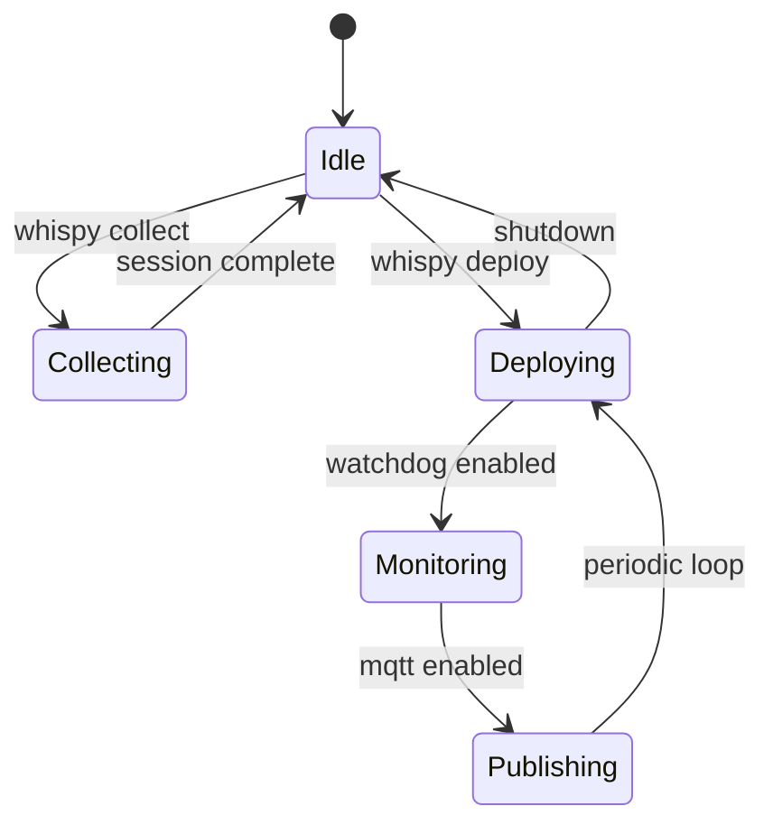

# 🔮 Whispy — WiFi Intelligence on ESP

**Whispy** is a Python toolkit for WiFi CSI (Channel State Information) sensing research using ESP32 microcontrollers. It provides an end-to-end pipeline from data collection to federated learning.

## Installation

```bash
pip install whispy                  # core only
pip install whispy[all]             # everything
pip install whispy[collect,camera]  # collection + face detection
pip install whispy[dl,fl]           # deep learning + federated
pip install whispy[mqtt]            # Home Assistant MQTT integration
pip install whispy[watchdog]        # system health + systemd
pip install whispy[pi]              # Raspberry Pi GPIO (ESP32 reset relay)
pip install whispy[backend]         # central server (FastAPI + SQLite)
```

## Quick Start

```bash
# Collect CSI data (1-min standardized files)
whispy collect --port COM5 --label myroom --duration 300

# Collect with face detection (auto occupancy labels)
whispy collect --port COM5 --label indoor --camera

# Deploy with 1 GB rolling cache (default)
whispy deploy --port COM5 --model ./model.pkl

# Deploy with Home Assistant integration
whispy deploy --port /dev/ttyUSB0 --model model.pkl \
    --mqtt-broker 192.168.1.100 --mqtt-node office --mqtt-location "Office" \
    --labels empty,occupied --cache-gb 1.0

# Deploy with watchdog + GPIO ESP32 reset
whispy deploy --port /dev/ttyUSB0 --model model.pkl \
    --watchdog --gpio-pin 17 --mqtt-broker localhost

# Test Home Assistant MQTT connection
whispy mqtt test --broker 192.168.1.100 --node office

# Export last 5 minutes from the rolling cache (Python API)
# from whispy.watchdog import export_cache
# export_cache(cache, minutes=5, n_files=5, out_dir="./data")

# Check system health
whispy watchdog status

# Generate systemd service for auto-start on Pi
whispy watchdog service --port /dev/ttyUSB0 --model model.pkl \
    --mqtt-broker localhost > /etc/systemd/system/whispy.service

# ── Global Deployment (central server + remote nodes) ──

# 1. Generate broker config with TLS + auth
whispy backend init --domain mqtt.example.com

# 2. Add credentials for a new device
whispy backend add-device --node-id lab-toronto-01

# 3. Start the central backend server
whispy backend start --broker mqtt.example.com --port 8000

# 4. On a remote Pi: deploy with cloud broker + auto-registration
whispy deploy --port /dev/ttyUSB0 --model model.pkl \
    --mqtt-broker mqtt.example.com --mqtt-port 8883 --mqtt-tls \
    --mqtt-user lab-toronto-01 --mqtt-password <pw> \
    --mqtt-node lab-toronto-01 --mqtt-location "Toronto Lab" \
    --latitude 43.6532 --longitude -79.3832 \
    --backend-url http://api.example.com:8000

# 5. Discover ESP32 receivers on the current machine
whispy device discover

# 6. Register device via REST API
whispy device register --node-id lab-toronto-01 \
    --location Toronto --latitude 43.65 --longitude -79.38 \
    --backend-url http://api.example.com:8000

# Load a built-in dataset from HuggingFace
whispy load OfficeLocalization --out ./data

# Train on a dataset
whispy train --data ./data/office_loc --pipeline rv20 --model rf

# Visualize results
whispy vis --results ./results/

# Federated learning simulation
whispy fl --data ./data/office_loc --strategy fedavg --clients 4
```

## Python API

```python
import whispy

# Load built-in dataset
train, test = whispy.load("OfficeLocalization")

# Build a processing pipeline
pipeline = whispy.Pipeline([
    whispy.Resample(in_sr=200, out_sr=150),
    whispy.RollingVariance(window=20),
    whispy.Window(length=500, stride=500),
    whispy.Flatten(),
])

# Train
results = whispy.train(train, test, pipeline=pipeline, model="rf")
whispy.vis.plot_results(results)
```

## Built-in Datasets

| Dataset | Task | Classes | Environment |
|---------|------|---------|-------------|
| `OfficeLocalization` | Localization | 4 | Office |
| `OfficeHAR` | Activity Recognition | 4 | Office |
| `HomeHAR` | Activity Recognition | 7 | Home |
| `HomeOccupation` | Occupancy Detection | 3 | Home |

## Modules

- **`whispy.collect`** — Standardized CSI collection with ESP32
- **`whispy.load`** — Built-in dataset loading from HuggingFace
- **`whispy.train`** — ML/DL training with configurable pipelines
- **`whispy.vis`** — Matplotlib visualization for results and live data
- **`whispy.fl`** — Federated learning with Flower (FedAvg, FedProx, etc.)
- **`whispy.core`** — CSI processing primitives (resampling, subcarrier mask, etc.)
- **`whispy.watchdog`** — Rolling CSI cache (resizable, default 1 GB), health monitoring, systemd integration, data export
- **`whispy.mqtt`** — MQTT publisher with Home Assistant auto-discovery, TLS, connection testing
- **`whispy.device`** — Device registry, receiver auto-discovery, GPS location, hardware attributes
- **`whispy.backend`** — Central FastAPI server: device registry, MQTT subscriber, data upload, FL coordination
- **`whispy.broker`** — Mosquitto config generator with TLS, authentication, ACLs for cloud deployment

## System Explanation

This section explains how Whispy operates as a complete CSI sensing system across collection, training, deployment, monitoring, and distributed coordination.

### Architecture Overview



### Data Flow

1. **Collection** (`whispy.collect`) reads CSI packets from ESP32 serial output and writes standardized session files.
2. **Core processing** (`whispy.core`) parses packet format, applies subcarrier masking (64 to 52), and builds time-series arrays.
3. **Pipeline transformations** (`whispy.pipeline`) apply resampling, rolling variance, windowing, and flattening.
4. **Training** (`whispy.train`) fits ML or DL models and returns metrics for evaluation.
5. **Deployment** (`whispy deploy`) runs the trained model on live CSI streams and emits predictions.
6. **Observability and integration** (`whispy.mqtt`, `whispy.watchdog`, `whispy.backend`) publish state, track health, and persist diagnostics.

### Deployment Topology



### Module Responsibilities

- **`whispy.collect`**: live collection loops, standardized storage, optional camera-assisted labeling.
- **`whispy.core`**: packet parsing and low-level CSI transforms.
- **`whispy.pipeline`**: composable preprocessing stages.
- **`whispy.train`**: training entrypoints for RF/XGB/MLP/Conv1D/CNN-LSTM.
- **`whispy.vis`**: result plots and exploratory visualizations.
- **`whispy.fl`**: federated simulation and aggregation strategies.
- **`whispy.mqtt`**: telemetry publishing, Home Assistant discovery, and broker connectivity checks.
- **`whispy.watchdog`**: health checks (rate, CPU, memory, disk), systemd heartbeat, and recovery hooks.
- **`whispy.device`**: device metadata, receiver discovery, and node registration helpers.
- **`whispy.backend`**: central API for devices, uploads, predictions, diagnostics, and FL exchange.
- **`whispy.broker`**: Mosquitto configuration generation with TLS/auth/ACL support.

### Runtime States



### Why the backend + MQTT path exists

The MQTT path is optimized for low-latency state sharing with smart-home and automation systems. The backend path is optimized for persistence, querying, cross-device coordination, and FL model lifecycle management. In practical deployments, both run together: MQTT carries real-time events while the backend stores history and orchestration metadata.


## License

MIT
