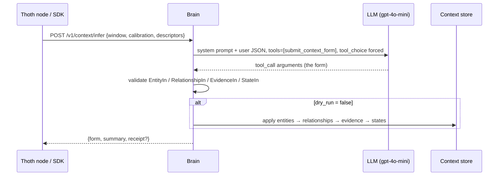

# LLM context inference — `POST /v1/context/infer`

Brain turns one time window of physical sensor evidence into a **complete
context form**: entities, relationships, evidence and states. The model
has exactly **one output channel**, a forced OpenAI function call
`submit_context_form`. Every response is therefore structured, and it is
validated against the same pydantic models the `/v1/context` REST
endpoints use before anything is stored.



## Request

| Field | Meaning |
| --- | --- |
| `window` | Bounds + provenance: `start_ts`, `end_ts`, `device_id`, optional `room_id` |
| `calibration` | Per-target-class statistics (priors, means/stds, thresholds, support) keyed by state key |
| `descriptors` | Everything measured in the window: **raw field statistics** per sensor (`mean/std/min/max`), **cues** (people, faces, motion…), **model predictions** (label + confidence), and a one-line `scene` text |
| `entity_hint` | Canonical entity the window concerns, e.g. `person:gad` |
| `dry_run` | `true` returns the form without writing it |

The scope required is `context:write`. The model is set by
`CONTEXT_INFER_MODEL`, falling back to `MODEL_NAME`, then `gpt-4o-mini`.

## Exact prompt sent to the model

**System message** (verbatim from `server/v1/context_infer.py`):

```text
You are the context-layer estimator for a sensor-fusion platform. For
each request you receive:
  * `calibration` — statistics of the target classes learned during
    calibration (per-class feature means/stds, thresholds, priors,
    support counts).
  * `descriptors` — physical descriptors of ONE time window from the
    sensors (CSI/radar/BLE/IMU summaries, RSSI values, variances,
    packet counts, spectral features).
  * `window` — the window's bounds and provenance.

Classify the window against the target classes using the calibration
stats, then respond ONLY by calling submit_context_form. Do not emit
plain text. Rules:
  * states[] must contain one entry per target class key the platform
    uses (e.g. occupancy.v1, activity.v1, location.v1); value is the
    predicted label/object, confidence is calibrated by distance to the
    class statistics — not raw probability.
  * evidence[] records what you based the prediction on (the model
    probabilities, the descriptors, the calibration reference).
  * entities[] and relationships[] describe WHO/WHERE/WHAT the window
    implies — create them when confident, omit when unsupported.
  * Confidence must reflect the descriptor-vs-calibration distance:
    a window far from every class centroid yields low confidence, not
    a forced label.
  * All numbers are floats (epoch seconds); no prose inside values.
```

**User message:** `json.dumps({window, entity_hint, calibration, descriptors})`.

**Tool:** `submit_context_form(summary, entities[], relationships[], evidence[], states[])`.
`summary` and `states` are required. Evidence carries a form-local `ref`
(`ev1`, …), and states cite it through `evidence_refs`. Brain resolves those
refs to real evidence row ids after insertion.

## Real captured round trip

This was captured live from production on 2026-10-08 against the `denver`
desktop node (`acceptance/_capture_context_infer.py`). Latency was 2.2 s.

**Request** (abridged — 2 of 5 sensors shown):

```json
{
  "window": {"start_ts": 1791512189.77, "end_ts": 1791512199.77,
             "device_id": "c1046bd3-dc05-5f34-a502-32d5bbb859a8"},
  "calibration": {"occupancy.v1": {"classes": ["absent", "present"],
                                   "priors": {"absent": 0.5, "present": 0.5}}},
  "descriptors": {
    "scene": "system: cpu_percent 99.2, mem_percent 98.2, battery_percent 100 | microphone: sample_rate 1.6e+04, channels 1, duration_s 0.1 | camera: 16 frames; camera: nobody visible | sensor: missing | sensor: missing",
    "predictions": {
      "rm-c9a29fffd4a1": {"label": "no_face", "confidence": 0.9, "timestamp": 1791512199.57},
      "rm-ff914758cbfc": {"label": "no_face", "confidence": 0.9, "timestamp": 1791512199.27}
    },
    "sensors": {
      "camera-6d1a": {"type": "camera", "n": 16, "rate_hz": 7.78, "age_s": 0.68,
        "fields": {"width": {"mean": 640, "std": 0, "min": 640, "max": 640},
                   "height": {"mean": 480, "std": 0, "min": 480, "max": 480}},
        "cues": {"people": 0, "faces": 0, "confidence": 0.9},
        "text": "camera: 16 frames; camera: nobody visible"},
      "system-0": {"type": "system", "n": 1,
        "fields": {"cpu_percent": {"mean": 99.2}, "mem_percent": {"mean": 98.2},
                   "battery_percent": {"mean": 100.0}}}
    }
  },
  "entity_hint": "person:gad",
  "dry_run": true
}
```

**Response** (complete, verbatim):

```json
{
  "form": {
    "summary": "No person detected in the scene, occupancy likely absent.",
    "states": [{"key": "occupancy.v1", "value": "absent", "confidence": 0.8}],
    "evidence": [{
      "ref": "ev1", "key": "occupancy.v1",
      "value": "calibration: absent, present; priors: 0.5, 0.5; descriptors: no face detected, camera shows nobody, high system resource usage, no audio evidence",
      "timestamp": 1791512199.76507, "confidence": 0.8}]
  },
  "summary": "No person detected in the scene, occupancy likely absent.",
  "dry_run": true,
  "generated_at": 1791514154.55
}
```

The model created no `entities`/`relationships` because nothing in the
window supported a person, which is what the prompt's "omit when
unsupported" rule asks for. With `dry_run: false` the response also carries
a `receipt` listing the stored entity keys, relationship ids, evidence ids
(`{ref, id}`) and state rows, plus per-section validation `errors` if any.

## From the SDK

```python
from whispy import Client
c = Client()
scene = c.scenes(limit=1)[0]          # latest descriptors.v1 evidence
form = c._http.request("POST", "/v1/context/infer", body={
    "window": {"end_ts": scene["timestamp"], "device_id": scene["device_id"]},
    "calibration": {...}, "descriptors": scene, "dry_run": True})
c.context_rebuild(window_s=60, dry_run=True)   # rolling builder pass
```
