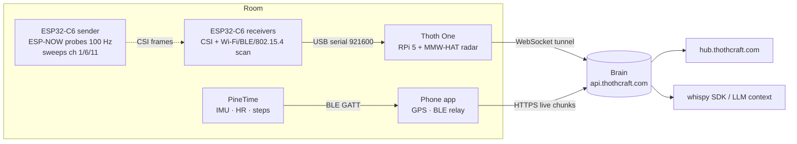

# Official hardware

Thothcraft runs on any Linux/macOS/Windows box, but three devices are
first-class: they ship firmware we maintain, appear on the fleet map, and
are tested on every release.

| Device | Role in the fleet | Firmware | Local access |
| --- | --- | --- | --- |
| [Thoth One](hardware/thoth-one.md) | Room node — 60 GHz radar, models, automations | `thothNode` (Python daemon) | `http://thoth-<name>.local:5000` |
| [ESP32-C6 CSI board](hardware/esp32.md) | Wi-Fi CSI + radio scanning, one image for all roles | `thothESP` (`thoth_csi`) | `http://thoth-<name>.local:5000` (when joined to Wi-Fi) |
| [PineTime watch](hardware/pinetime.md) | Wrist IMU, heart rate, steps, BLE neighbour scan | `thothWatch` (InfiniTime fork) | via the phone app (BLE) |

<iframe class="hw-embed" src="https://thothcraft.com/hardware?embed=1" title="Thoth hardware 3D"></iframe>

## How they connect

Every node and ESP32 board uses **one** local port, `5000`, for both the
dashboard and the API, and advertises itself over mDNS as
`thoth-<name>.local`. The same hostname is shown on the device card in the
phone app and in the hub.
