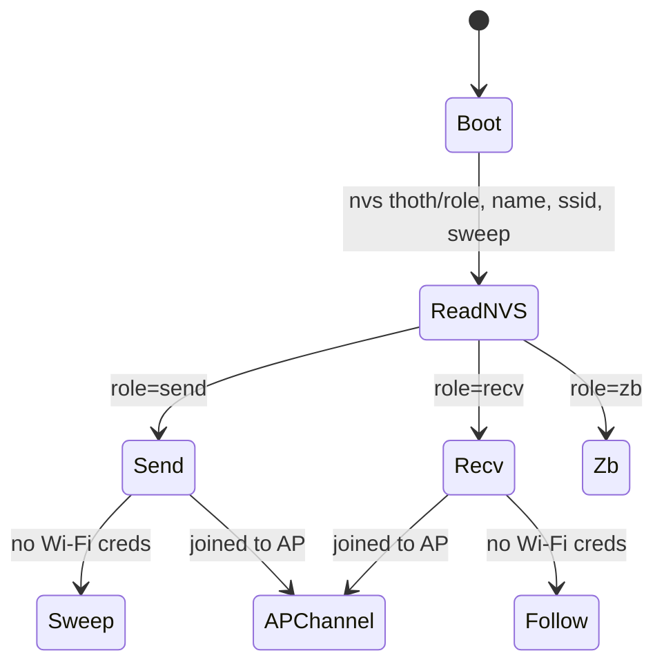
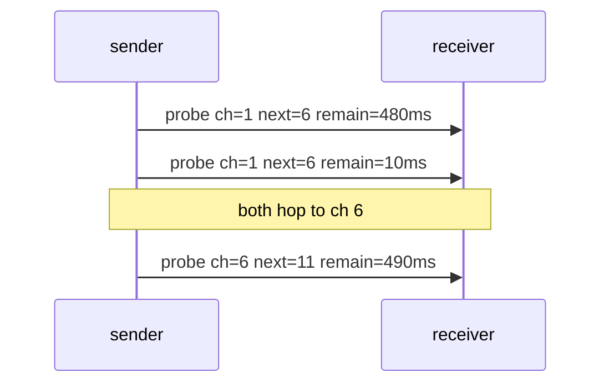

# ESP32-C6 CSI board — `thoth_csi` firmware

Every ESP32 board in the fleet runs the **same binary**. There is no
"tx image" and "rx image" any more, so boards are no longer named
`thoth-csi-tx` / `thoth-csi-rx`. Each board is `thoth-<name>`, by default
`thoth-esp32-<last 4 hex of its MAC>`, whatever role it plays.

<iframe class="hw-embed" src="https://thothcraft.com/hardware/esp32?embed=1" title="ESP32-C6 3D"></iframe>

## Specifications

| | |
| --- | --- |
| Board | ESP32-C6-DevKitC-1 (51.8 × 25.4 mm), ESP32-C6-WROOM-1 module |
| CPU | RISC-V HP core 160 MHz + LP core 20 MHz, 512 KB SRAM |
| Radios | Wi-Fi 6 2.4 GHz · BLE 5 · IEEE 802.15.4 |
| Flash layout | bootloader `0x0` · partition table `0xa000` · app `0x20000` (2 MB, dio, 80 MHz) |
| Host link | USB-C serial @ **921600** baud |
| CSI | HT20 LTF, ESP-NOW probes @ 100 Hz from the sender |

## One image, three roles

The role lives in NVS (`thoth/role`) and is chosen at runtime:

| Role | What it does | Serial output |
| --- | --- | --- |
| `send` | Broadcasts ESP-NOW probes (shared identity MAC `1a:00:00:00:00:00`), leads the channel sweep, BLE identity beacon | `SELF_DATA`, logs |
| `recv` | Captures CSI from the sender's probes, follows the sweep, promiscuous Wi-Fi + BLE scan | `CSI_DATA`, `WIFI_DATA`, `BLE_DATA`, `HEALTH_DATA`, `SELF_DATA` |
| `zb` | Raw IEEE 802.15.4 scanner/broadcaster | `ZB_DATA`, `ZB_INFO` |



## CSI channel sweep

Without a Wi-Fi uplink the **sender leads** a hop across channels
(default `1,6,11`, 500 ms dwell). Every probe carries the schedule:

```c
struct csi_probe { uint32 count; char magic[2] = "TC";
                   uint8 ch; uint8 next_ch; uint16 remain_ms; };
```

Receivers read it from the ESP-NOW callback and hop to `next_ch` after
`remain_ms`, so they stay in lockstep with the sender. A receiver that
hears nothing for 1.5 s hunts across channels 1–13 (250 ms dwell) until it
finds the sender again. Each `CSI_DATA` line carries its `channel`, so hosts
can split features per channel.



A board that has joined an AP cannot hop, because an associated STA is
pinned to the AP's channel. It runs CSI on that channel and the sweep is
disabled.

## Local dashboard

Give a board Wi-Fi credentials and it joins your network, serves a status
dashboard on **port 5000** and advertises `thoth-<name>.local` over mDNS:

| Endpoint | |
| --- | --- |
| `GET /` | Live status page: role, CSI frames/s, channel, sweep, IP, RSSI, heap |
| `GET /api/v1/status` | Same as JSON (`name`, `hostname`, `role`, `mac`, `ip`, `port`, `channel`, `sweep`, `csi_frames`, `uptime_s`, `free_heap`, `ap_rssi`) |

When the board gets an IP it also prints
`NET_DATA,<ip>,thoth-<name>.local,5000,<channel>`. whispy parses this line
into a `net` payload, which is how the host learns the board's hostname.

## Serial console

| Command | Effect |
| --- | --- |
| `role?` / `role=send\|recv\|zb` | show / persist role (reboots) |
| `name?` / `name=<label>` | show / set name → `thoth-<label>` (reboots) |
| `wifi?` / `wifi=<ssid>,<pass>` / `wifi=` | show / join / forget Wi-Fi (reboots) |
| `sweep?` / `sweep=0\|1` | show / toggle channel sweep (reboots) |
| `chans=1,6,11` | sweep channel list (reboots) |

## Flash

```bash
python esp32/flash.py --port COM10 --build-dir esp32/firmware/thoth_csi/build
# or on a Pi
python -m esptool --chip esp32c6 --port /dev/ttyACM0 -b 460800 write_flash -z \
  --flash_mode dio --flash_freq 80m --flash_size 2MB \
  0x0 bootloader.bin 0xa000 partition-table.bin 0x20000 thoth_csi.bin
```

Flashing does not touch NVS, so role, name and Wi-Fi credentials survive
firmware updates. Build: ESP-IDF v5.5, `idf.py set-target esp32c6 build`.
