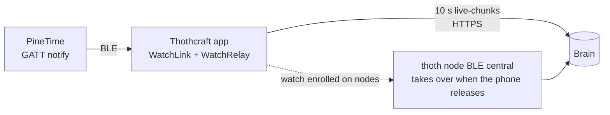

# PineTime — thothWatch firmware

The PineTime runs **thothWatch**, our fork of InfiniTime (`1.16.99-thoth`).
It is a wrist sensor: motion, steps, heart rate, battery, and a BLE
neighbour scan. It reaches Brain through the phone app.

<iframe class="hw-embed" src="https://thothcraft.com/hardware/pinetime?embed=1" title="PineTime 3D"></iframe>

## Specifications

| | |
| --- | --- |
| SoC | Nordic nRF52832 — Cortex-M4F 64 MHz, 512 KB flash, 64 KB RAM |
| Display | 1.3" 240 × 240 IPS LCD, capacitive touch |
| Sensors | Bosch BMA421 accelerometer · HRS3300 PPG heart rate |
| Storage | 4 MB SPI NOR |
| Radio | Bluetooth 5 LE |
| Battery | 180 mAh Li-Po |
| **GPS** | **None.** `pinetime-gps` samples are the **phone's** GPS, attached to the watch stream |

## Where each signal comes from

| Sensor id (Brain) | Source device | Notes |
| --- | --- | --- |
| `pinetime-motion` | watch | BMA421 x/y/z (1 g = 1024); stamped char adds tick + seq |
| `pinetime-hr` | watch | HRS3300 via 0x2A37 |
| `pinetime-steps` | watch | step counter |
| `pinetime-battery` | watch | percent |
| `pinetime-prox` | **phone** | BLE RSSI of the watch link → proximity |
| `pinetime-gps` | **phone** | phone location trace |

Laptops and Thoth nodes have no GPS. The phone is the only GPS source in
the fleet.

## Data path

### Background streaming (Android)

The relay lives in the app process and is kept alive by a **foreground
service** (`connectedDevice|location|dataSync`) plus a wakelock:

1. **App launch:** the watch manager is built immediately, so paired watches
   re-link without opening the watch screen.
2. **Screen off / app minimised:** the foreground service ("PineTime relay
   active") keeps the BLE link, GPS trace and uploads running.
3. **Reboot / app update:** `autoRunOnBoot` and `autoRunOnMyPackageReplaced`
   restart the service (`RECEIVE_BOOT_COMPLETED`).
4. **Swipe-kill / OEM kill:** the process is gone, so allow the
   battery-optimisation exemption when the app asks. While the phone is
   away, a Thoth node that has the watch enrolled connects directly.

## GATT inventory

Custom services use the InfiniTime base `SSSS0000-78fc-48fe-8e23-433b3a1942d0`.

| Service | Characteristic | UUID | Access |
| --- | --- | --- | --- |
| Motion (0003) | steps | `00030001-…` | read / notify |
| | raw accel | `00030002-…` | read / notify (stock: only on change) |
| | **stamped accel** (thoth) | `00030003-…` | notify always — x,y,z int16 + tick uint32 + seq |
| Scan (0004, thoth) | results | `00040001-…` | notify — seq, n, {mac, rssi, name} |
| | control | `00040002-…` | write `0x01` on / `0x00` off |
| Heart rate | measurement | `0x2A37` | notify |
| Battery | level | `0x2A19` | read / notify |
| Current time | time | `0x2A2B` | write (synced on every connect) |
| Alert notification | new alert | `0x2A46` | write — the vibration actuator |
| Music / Navigation | `0000xxxx` / `0001xxxx` | | write / notify |

## Flash (DFU)

The release ships `InfiniTime-dfu-<ver>.zip`. In the app, open
**Watch → Firmware → Update** and pick the zip. The link pauses telemetry
during transfer, and the watch reboots into the new image. Validate it from
the watch (**Settings → Firmware → Validate**) so it doesn't roll back.
