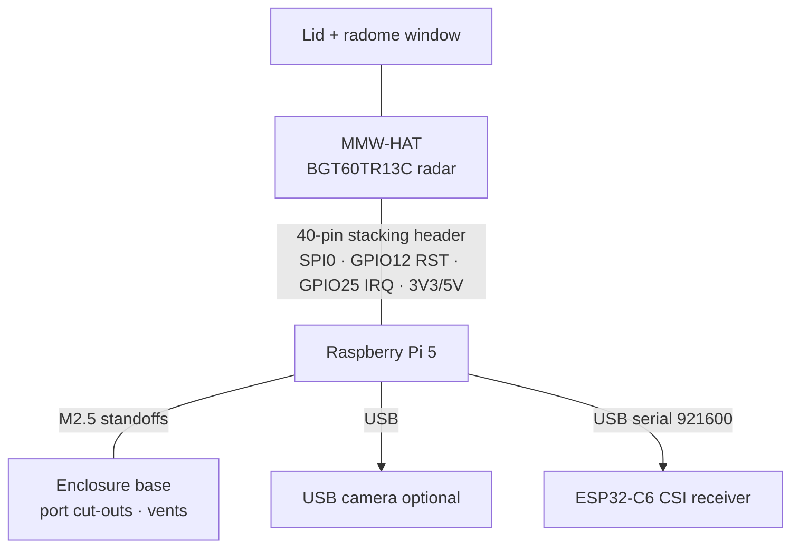
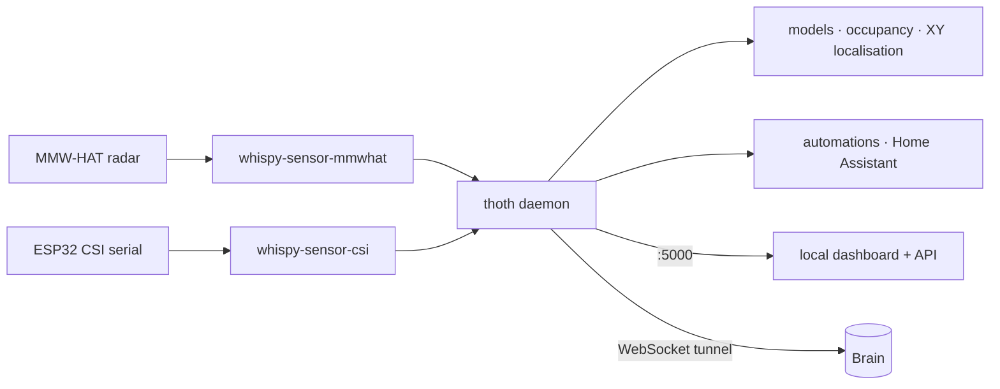

# Thoth One — Raspberry Pi 5 + MMW-HAT

A room-sensing node: a Raspberry Pi 5 with the MMW-HAT 60 GHz FMCW radar,
in a 3D-printed enclosure with a hinged lid and a radome window over the
antennas. Optional modalities plug in over USB (camera, ESP32-C6 CSI
boards).

<iframe class="hw-embed" src="https://thothcraft.com/hardware/thoth-one?embed=1" title="Thoth One enclosure 3D"></iframe>

Drag to orbit; the lid opens and closes so you can see the Pi 5 + HAT stack.

## Specifications

| | |
| --- | --- |
| Compute | Raspberry Pi 5 — BCM2712, 4× Cortex-A76 @ 2.4 GHz, 4/8 GB LPDDR4X |
| Radar | Infineon **BGT60TR13C** FMCW, 58–63 GHz, 1 TX / 3 RX (L-shaped array → azimuth + elevation) |
| Default profile | 58–60 GHz (2 GHz sweep) → range resolution c / 2B ≈ **7.5 cm** |
| Radar link | SPI0, mode 0, 10 MHz (50 MHz in streaming), **RST = BCM GPIO12**, **IRQ = BCM GPIO25** |
| Connectivity | Gigabit Ethernet, Wi-Fi 5, Bluetooth 5.0 / BLE |
| I/O | 2× USB 3.0, 2× USB 2.0, 2× micro-HDMI, 40-pin GPIO, PCIe FFC |
| Power | USB-C 5 V / 5 A (27 W supply recommended) |
| Enclosure | PLA/PETG print, ~104 × 76 × 47 mm, vent slots, port cut-outs, radome window |
| OS | Raspberry Pi OS / Debian 13 (trixie), aarch64 |
| Local access | `http://thoth-<name>.local:5000` — dashboard **and** API on one port |

## Assembly



| HAT signal | Pi 5 header pin | BCM |
| --- | --- | --- |
| SPI0 MOSI | 19 | GPIO10 |
| SPI0 MISO | 21 | GPIO9 |
| SPI0 SCLK | 23 | GPIO11 |
| SPI0 CE0 | 24 | GPIO8 |
| Radar reset | 32 | GPIO12 |
| Radar IRQ | 22 | GPIO25 |
| 3V3 / 5V / GND | 1 / 2 / 6 | — |

> A chip-id read of `0xFFFFFFFF` means the SPI path is wrong (wrong bus, HAT
> not seated, MISO pulled high). A healthy HAT reads `0xF4000303` on SPI bus 0.

## Software stack



## Install

```bash
curl -fsSL https://thothcraft.com/install | sudo THOTH_HOSTNAME=thoth-<name> bash
thoth pair      # link to your thothHUB account
```

The installer creates `thoth.service` (systemd), publishes
`thoth-<name>.local` through Avahi and serves everything on port **5000**.
Release builds also ship a `.deb` (`thoth-node_<ver>_arm64.deb`) on the
[download page](https://thothcraft.com/download).

## Uninstall

```bash
sudo systemctl disable --now thoth.service
sudo rm /etc/systemd/system/thoth.service && sudo systemctl daemon-reload
rm -rf ~/thoth/.venv          # keep ~/.thoth to preserve pairing
```
